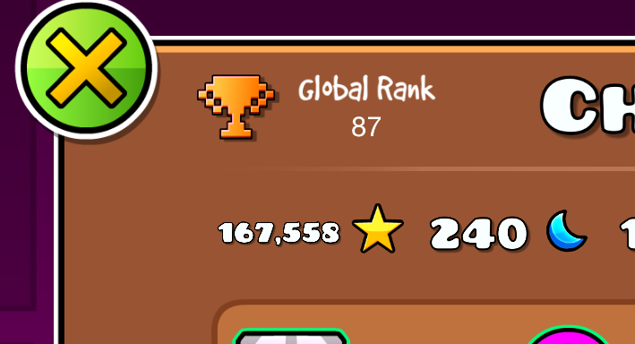

> [Official GD Leaderboard Guidelines](https://www.robtopgames.com/files/GDLeaderboards.pdf)
> 
> [Official GD Leaderboard Discord Server](https://discord.gg/PwdrGesHC6)
> 
> [Official GD Top 1000](https://www.boomlings.com/database/accounts/getTop1000.php)

# Global Ranks
General information about the GD global ranking system.

*This document is not officially made by RobTop or in-game Leaderboard Mods nor is it affilated with any of them*

<!-- EDITOR'S NOTE: Rank Bans purposefully is linked to what it is to avoid -->
### Glossary
* [What it is](#what-it-is)
* [Rank Bans](#what-it-is)
* [Global Leaderboard](#global-leaderboard)
* [Top 1000 Leaderboard](#top-1000-leaderboard)
* [History](#history)

---

## What it is

 

A player's global rank is determined by their position in the official in-game top stars. As of date, this leaderboard is split into two sections: the Top 1000 Leaderboard and Global Leaderboard

### Rank Bans

When a user a rank banned by a in-game leaderboard mod, they are removed from the global leaderboard and are prevented from being able to rejoin the section until the ban is lifted. The user's profile appears like any other unranked user. The global rank will not be displayed on the profile (showing as 0 in the code)

> [!CAUTION]  
> If you are experiencing ranking issues, have concerns, or just need general support, you can join the official GD leaderboard Discord server ([here](https://discord.gg/PwdrGesHC6)) to find additional resources and ask for help

### Global Leaderboard

This is the first official rank section. Since it's creation, it has been adjusted to only rank players from 1001+, inclusively. Players are able to join this section after reaching 500 stars. Addition to this section is done when it is refreshed which is done <u>manually by RobTop</u> usually within a 2-week period

### Top 1000 Leaderboard

This is the second official rank section that contains players from rank 1 - 1000, inclusively. It refreshes players hourly. It is manually managed by the in-game leaderboard mods

## History
* `Update 2.2` - Leaderboard Mods have been given an in-game badge and fully manage the in-game leaderboard
* `September 7, 2021` - GD Leaderboard Discord server goes public
* `August 11, 2021` - GD Leaderboard Discord server created
* `May 21, 2021` - Second leaderboard refresh since the official stop, the launch of the Top 1000, and the introduction of a small group of undisclosed leaderboard mods and helpers
* `July 22, 2017` - First leaderboard refresh since the official stop
* `May 28, 2017` - RobTop stops automatic leaderboard refreshing
* `Update 2.0` - Removal of Top Week Leaderboard (replaced by Friends Leaderboard)
* `Update 1.6` - Introduction of Top Week Leaderboard