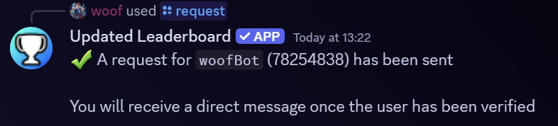

> [In-game Global Rank Information](../_gdGlobalRanks.md)

# Getting on the Leaderboards
Step by step guide of the Bot's leaderboard verification process

### Glossary
* [1) The Difference](#1-the-difference)
* [2) The Bot's "/request" Command](#2-the-bots-request-command)
* [3) The Waiting Game](#3-the-waiting-game)
* [4) Verification Process](#4-verification-process)
* [5) Leaderboard Ready](#5-leaderboard-ready)
* [6) Leaderboard Requirements](#6-leaderboard-requirements)

---

### 1) The Difference

 

The leaderboards are <u>based on the official in-game GD leaderboards</u> and only serve to extend them. To be clear, these leaderboards are NOT official GD content. Any affilation with RobTop or with the in-game leaderboard mods that does exist, will exist, or could exist will NEVER impact your in-game [global rank](../_gdGlobalRanks.md)

**Further in this reading, <u>any mention of "leaderboard" will NOT refer to the GD leaderboard (unless specifically stated)</u>**

 

### 2) The Bot's "/request" Command

 

In a Discord text channel, type "/request" and look for the bot's command option. Then in the "user" parameter, type your GD username. Then send the command. Once successful, this will send a request message to the bot staff for them to take a look at the account for leaderboard verification

> [!IMPORTANT]  
> If you are unable to find the command in the chat bar, it is most likely because either the bot does not have access to that text channel OR your Discord app needs to be updated. You may need to switch to a different text channel or configure the bot's channel permissions

 

### 3) The Waiting Game

 

The verification process is completely manual. Specifically, it will take time for bot staff to see the message, check the profile, and then verify each individual user. There is no guarantee but you can generally expect a request to be handled within 24 hours (Note: in order to receive the DM, you must have DM messages enabled).

If you feel like your request is taking longer than necessary, feel free to reach out to the helper team in [our Discord server](https://discord.gg/Uz7pd4d)

 

### 4) Verification Process

 

After your request has been verified, the bot will attempt to send you a DM. This DM is a notification that the user you had requested had been verified

 

### 5) Leaderboard Ready

Your GD account is now leaderboard ready. Momentarily, you will be able to see your account on the bot's leaderboards. Note, some leaderboards do have individual requirements in order for a user to be shown:

 

### 6) Leaderboard Requirements

The entire goal of these requirements is to prevent unecessary users from being displayed. The average player should never run into any issues with these requirements. Below, you can find some of the basic requirements that are checked:

> * User has a [global rank](../_gdGlobalRanks.md)
>   * For issues, see [The Difference](#1-the-difference)
> * User is [leaderboard verified](#2-the-bots-request-command)
> * Creator points leaderboard requires user to have at least 1 creator point
> * GD Mods bypass most requirements