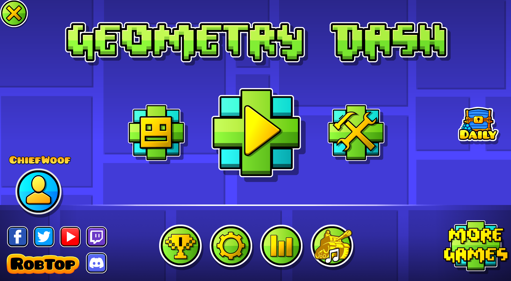
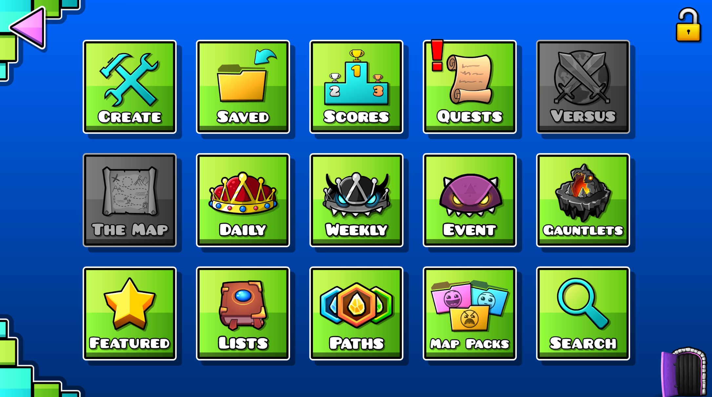
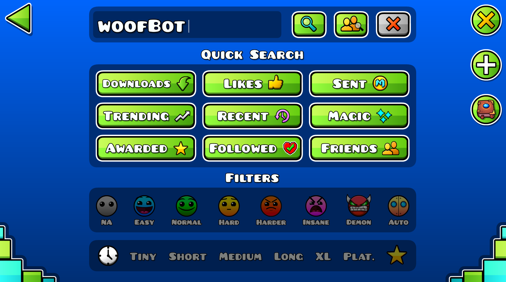
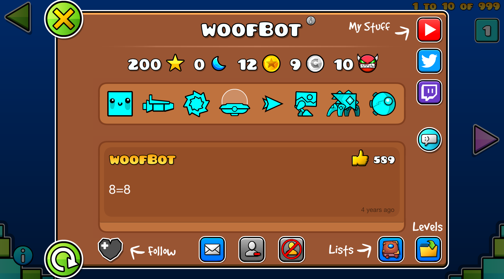
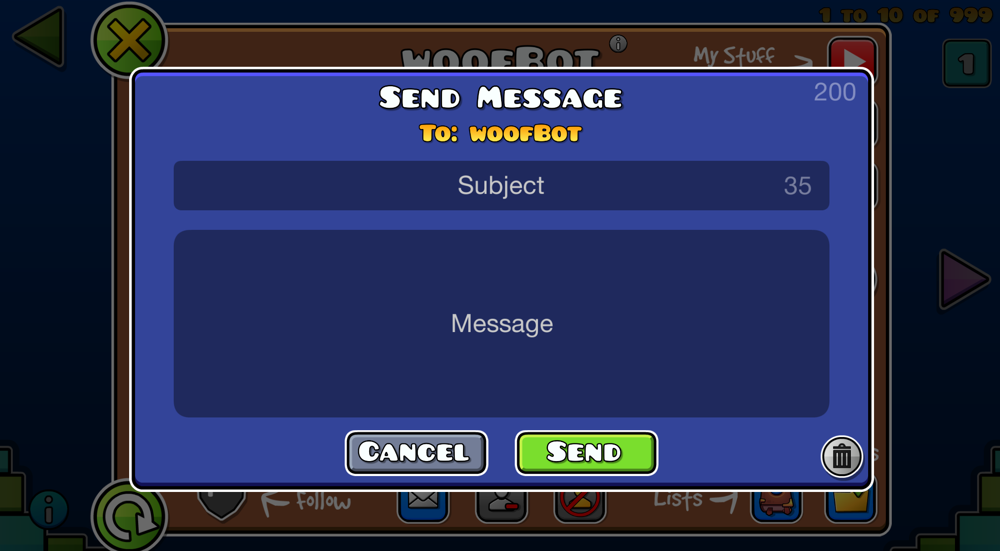
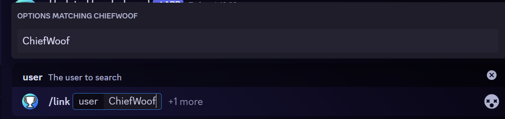
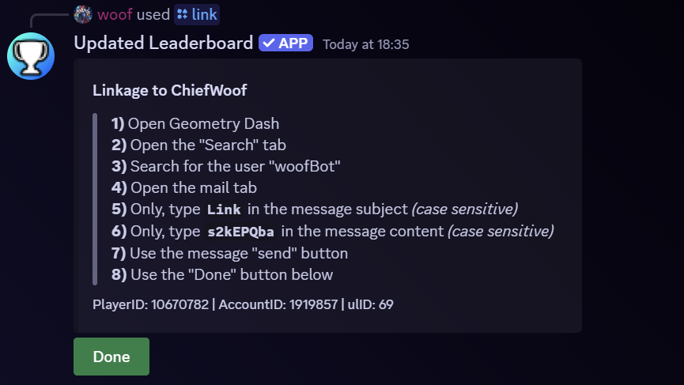
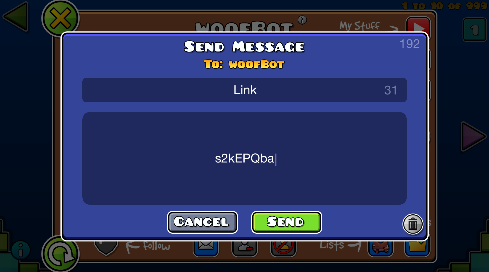
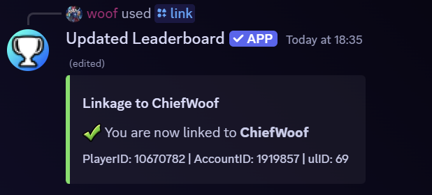

# Linking Your GD Account
Step by step guide on linking your GD account to your Discord account

### Glossary
* [1) Navigating to User Selection](#1-navigating-to-user-selection)
* [2) Getting to woofBot's profile](#2-getting-to-woofbots-profile)
* [3) The Bot's /link Command](#3-the-bots-link-command)
* [4) Sending the Link Message](#4-sending-the-link-message)
* [5) Completing the Process](#5-completing-the-process)

---

### 1) Navigating to User Selection

 

On the GD startup menu page, open up the online menu section (the button is to the right of the play button in the center)

 

 

Once on this page, open up the "Search" section

 

### 2) Getting to woofBot's profile

 

Once on this page, type "woofBot" into the search bar. Then, use the user search button (it's the first button to the right of the magnifying lens button)

 

 

Once the name is searched, open up the first user's profile. Then on the profile, use the mail button

 

 

### 3) The Bot's "/link" Command

 

In a Discord text channel, type "/link" and look for the bot's option. Then in the "user" parameter, type your GD username. Then send the command

> [!IMPORTANT]  
> If you are unable to find the command in the chat bar, it is most likely because either the bot does not have access to that text channel OR your Discord app needs to be updated. You may need to switch to a different text channel or configure the bot's channel permissions

 

### 4) Sending the Link Message

 

On the bot's response, you'll see a message subject and a message content procedure. The bot will ask you to send woofBot a message with the subject "Link" and a code (for this example, it's "s2kEPQba") for the message content

On GD, type "Link" into the message subject and the code (in this example, "s2kEPQba") into the message content

> [!IMPORTANT]  
> The message subject and content ARE CASE-SENSITIVE. This means you should NOT add any extra spaces or characters, or make any changes from what's directed

 

 

Once completed, use the send button

 

### 5) Completing the Process

 

After sending the message on GD, go back to Discord and use the "Done" button

 

 

Your GD account is now linked with your Discord account on the bot
